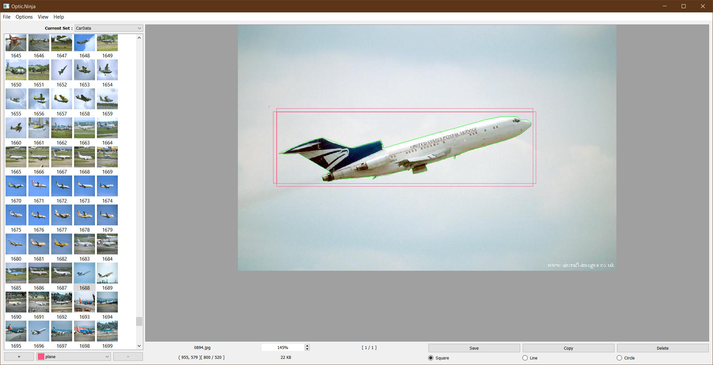

# Optic.Ninja

# Screenshot

### Description
This project aims to make a simple and efficent dataset editor.

### Current Support
    - Currently we are targeting image datasets.
    - Automatic annotation saving
    - CSV Export
    - Sqaure annotation marker
    - Polyline annotation marker
    - Circle annotation marker

### Roadmap
    - Improve "Lazy Loading List View".  Need to add the ability to unload items.
    - Improve ListView icon sizing, numbering, and view types.  Also make it resizable.
    - Add the ability to copy annotations and copy them between dataset items.
    - Add ability to switch to opengl dataset item view.
    - Add auto detection after certain number of annotations are added to datset items.
    - Add Unit tests
    - Add error correction and catching
    - Improve loading times and database creation method.
    - Add support for multi-part images
    - Common dataset importer

### Pull requests
Pull requests are welcome.  If you have something to contribute please do.  Trying to stick to Qt framework, but other libraries are also fine if your implementation is useful.

### Build

#### Linux
Simple install opencv libraris and it should automatically be detected.  Tested on Debian/Ubuntu.  Then simply build with Qt Creator either from the repos, or download Qt Creator directly from the Qt website.

#### Windows
Simply clone the repo and build with Qt Creator.  You can use MinGW or MSVC.

#### Mac
I haven't tested building on Mac yet, but it should work in a similar fashion to Linux.  I will test this soon.
